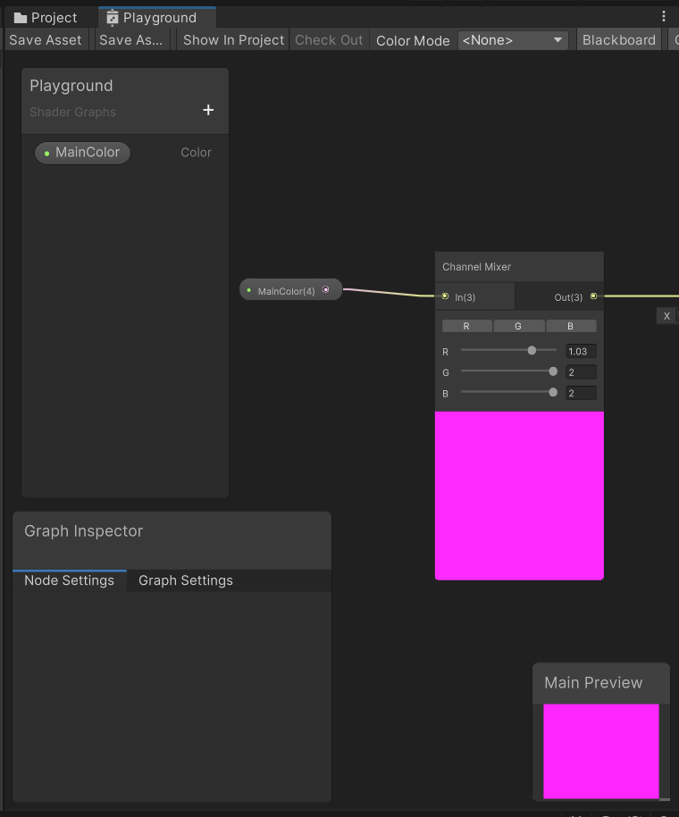
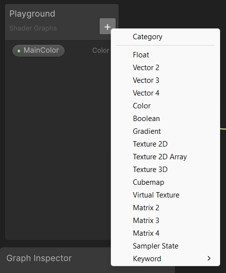
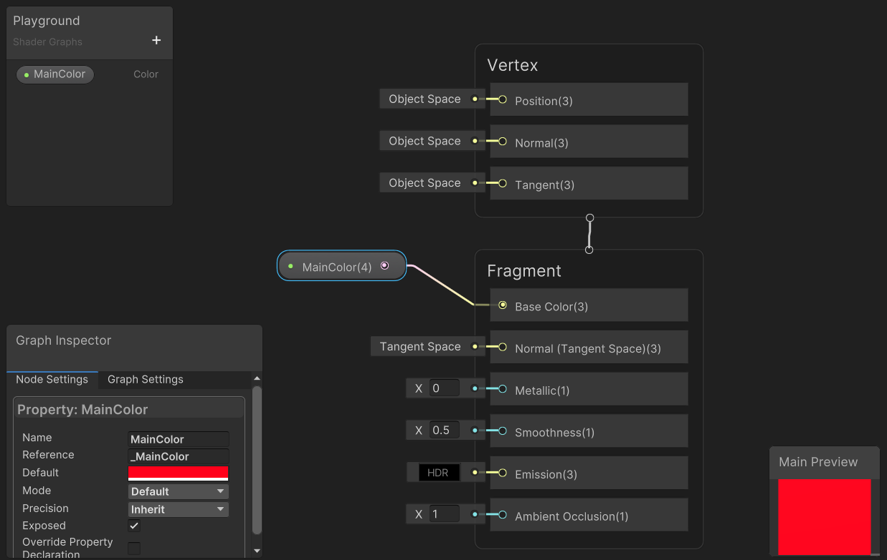
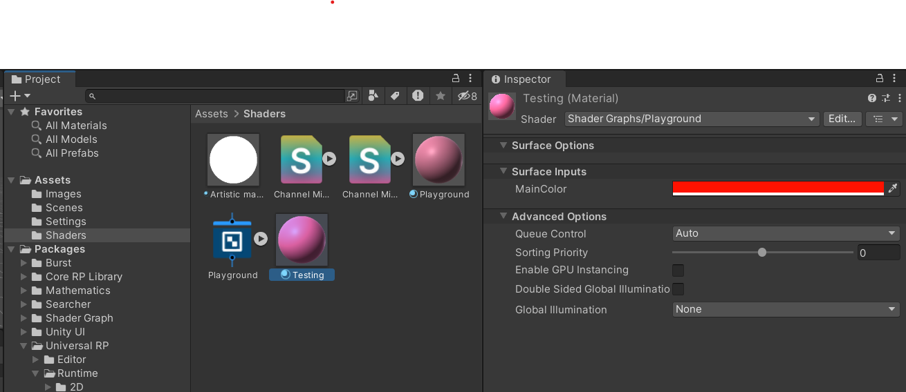
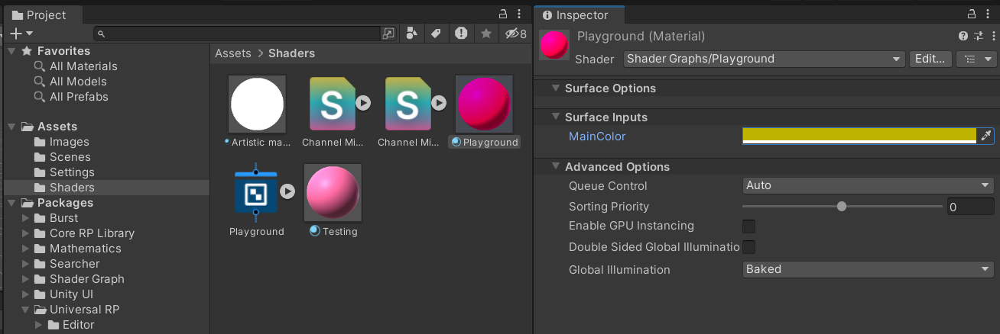
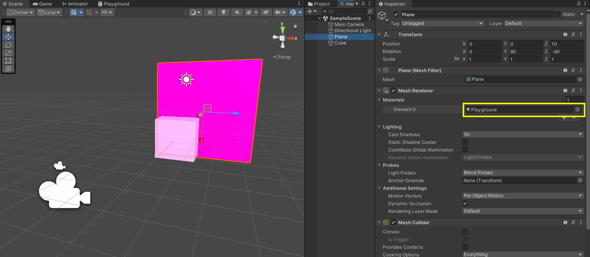

# Shaders in Unity
There are three main categories for shaders in unity:
1. Graphic shaders. Those that performe calculations to determine the color of the pixels on the screen.
2. Compute shaders. Compute calculations on the CPU, but these are out of the graphics pipeline.
3. Ray tracing shaders. They are focused on the lighting.

The Unity's Shaders are written in a Unity-specific language called ShaderLab. However, in Unity we can do shaders no-code with the Shaders Graph.

## Master stack.

A Master stack is the endpoint of every Shader Graph that defines the final surface appareance of a shader. The Shader Graphs should always contain only one.

The Master Stacks are made up of two contexts (Vertex and Fragment), wich contains Block nodes.

### Vertex Shader
Vertex shaders can manipulate the attributes of vertces, wich are your corner points of the polygons. It is part of the early steps in the graphic pipeline.

### Fragment (or pixel) shaders
Fragment shaders manage how the pixels between the vertices look. They are interpolated between the defined vertices. It is part of the rasterization step, where the image is calculated an the pixels between verticesare coloured.

> If you want your polygon to be completely red, you would define all vertices red. If you want for specific effects like a gradient between the vertices, you have to do that in the fragment shader.

## Version
For this project im working with:
- Unity 2022.3.19f1.
- Shadergraph 14.0.10
- Universal RP (render pipeline) 14.0.10
## Getting started
To install the URP (Universal Render Pipeline) into Unity, you can follow the next tutorial Unity made.
[Getting started](https://docs.unity3d.com/Packages/com.unity.render-pipelines.universal@17.0/manual/InstallingAndConfiguringURP.html).

To create our first Shader Graph we are going to right click in assets and then **Create $\to$ Shader Graph $\to$ URP $\to$ Lit Shader Graph**. This will create our shader graph with the basic configuration that allow us to preview how our nodes are affecting the resulting shader. *&mdash; I called it Playground.*

Here, we can use the properties box and add a Color property. *&mdash; I was already playgrounding with my shader graph*.

After set the name, drag and drop the property in the canvas, and connect it to the fragment context in the property Base color. This will show you the preview with the default value of the property.

With this done, we can create our first material. Click the `Save Asset` button or with the keyboard press `Ctrl+s` (Windows) or `command+s` (Mac). Go to the **project tab**, locate your shadergraph and right click on it. Go to **Create $\to$ Material** and it is, created.

If you select the material and watch the **inspector tab**, you'll see the properties you have created, and can define an specific value for each one. You can create many materials from the same shader graph and set different values for their properties.
*&mdash The colors of my materials looks different because I used the nodes Channel Mixer and Contrast to alter the color of the property.*.

Finally, you can add these materials into gameobjects of your scene.
*&mdash I assigned `Playground` material to the plane and `Testing` material to the cube*.

## Resources consulted.

The surrican, Stack Overflow. [Vertex shader vs Fragment Shader](https://stackoverflow.com/a/4421289/18456344)

Unity.  [Master Stack](https://docs.unity3d.com/Packages/com.unity.shadergraph@10.5/manual/Master-Stack.html?utm_source=demand-gen&utm_medium=pdf&utm_campaign=asset-links-gmg-artist-expansion&utm_content=technical-artist-ebook). 

Unity. [My first Shader Graph](https://docs.unity3d.com/Packages/com.unity.shadergraph@17.0/manual/First-Shader-Graph.html).