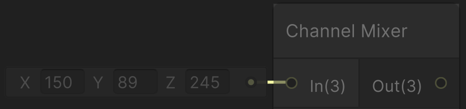
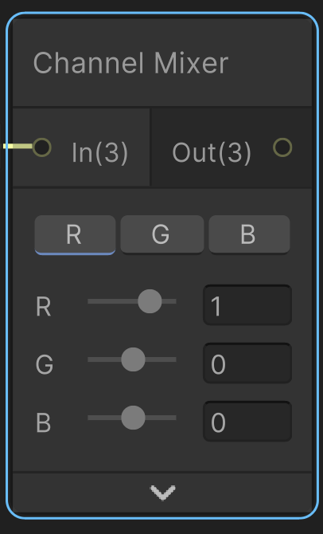
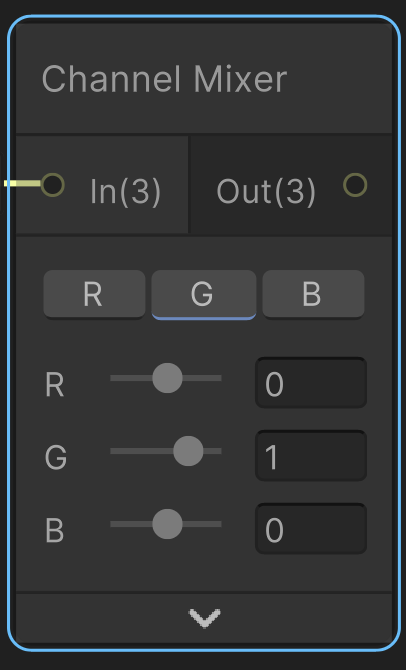
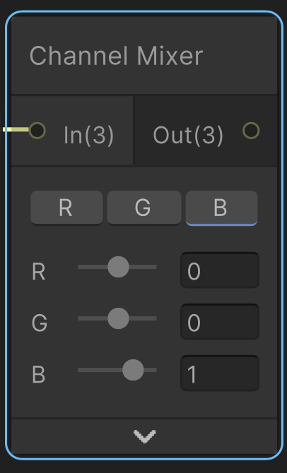
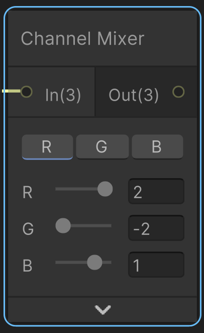
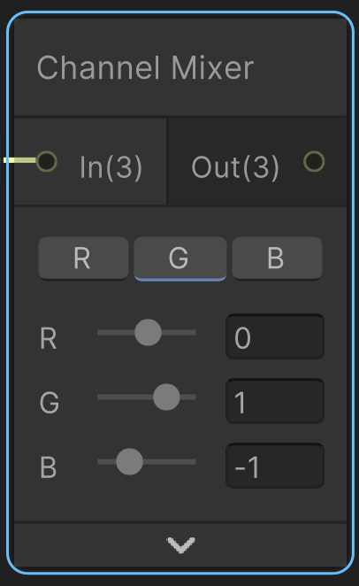
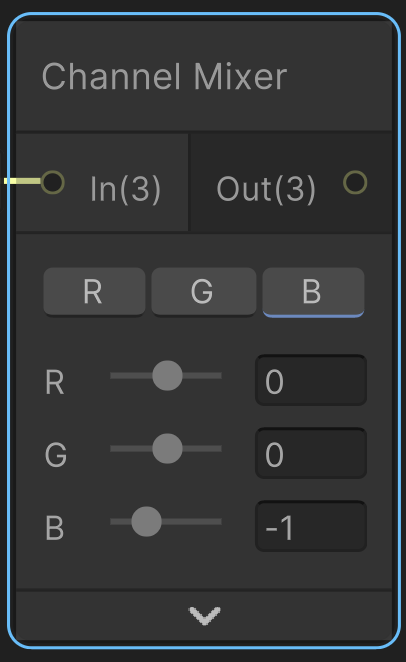

# Channel Mixer
It controls the ammount each of the channels of input *In* contribute each of the channels of output *Out*

### Inputs
In: Vector3

### Outputs
Out: Vector3

## Controllers
The sliders control the contribution of the input channels, and the toggle buttons control which output channel will be affected, it can be just one or all of them.

## Explanation
This is a code example (that the documentation gave us) this node can generate. I'm adding a little explanation.
```cs
/**
 * These are the configurations of the node sliders and
 * toggles. For example. If the toggle `R`
 * is active, it will be combined with the `G` slider
 * value, to produce OutRedInGreen,
 * the same with the other two sliders.
 * 
 * If the toggle `B` was not active, then it will ignore
 * the sliders values, 
 */
_ChannelMixer_Red = float3 (OutRedInRed, OutRedInGreen, OutRedInBlue);
_ChannelMixer_Green = float3 (OutGreenInRed, OutGreenInGreen, OutGreenInBlue);
_ChannelMixer_Blue = float3 (OutBlueInRed, OutBlueInGreen, OutBlueInBlue);

void Unity_ChannelMixer_float(float3 In, float3 _ChannelMixer_Red, float3 _ChannelMixer_Green, float3 _ChannelMixer_Blue, out float3 Out)
{
    /**
     * With dot(In, CHANNEL) we are getting the dot
     * product of In and each ChannelMixer given by
     * the node controllers. 
     */
    Out = float3(dot(In, _ChannelMixer_Red), dot(In, _ChannelMixer_Green), dot(In, _ChannelMixer_Blue));
}
```

If we had the input vector $I=\langle 150, 89, 245 \rangle$:



With the base values of the channel mixer node:

| R                                                                                                   | G                                                                                                   | B                                                                                                   |
| --------------------------------------------------------------------------------------------------- | --------------------------------------------------------------------------------------------------- | --------------------------------------------------------------------------------------------------- |
|  |  |  |
| $M_R = \langle -2, 2, 1 \rangle$                                                                     | $M_G = \langle 0, 1, -1 \rangle$                                                                     | $M_B = \langle 0, 0, -1 \rangle$                                                                     |

The output will be:

$O=\langle I \cdot M_R , I \cdot M_G , I \cdot M_B \rangle$


$O=\langle 150(1)+89(0)+245(0), 150(0)+89(1)+245(0) , 150(0)+89(0)+245(1) \rangle$

$O=\langle 150, 89, 245 \rangle$

This is because we have not modified the node values, and these original values are the unit vectors of each channel.

If we modify the values:

| R                                                                                              | G                                                                                              | B                                                                                              |
| ---------------------------------------------------------------------------------------------- | ---------------------------------------------------------------------------------------------- | ---------------------------------------------------------------------------------------------- |
|  |  |  |
| $M_R = \langle 1, 0, 0 \rangle$                                                                | $M_G = \langle 0, 1, 0 \rangle$                                                                | $M_B = \langle 0, 0, 1 \rangle$                                                                |

$O=\langle I \cdot M_R , I \cdot M_G , I \cdot M_B \rangle$

$O=\langle 150(-2)+89(2)+245(1), 150(0)+89(1)+245(-1) , 150(0)+89(0)+245(-1) \rangle$

$O=\langle 123, -156, -245 \rangle$